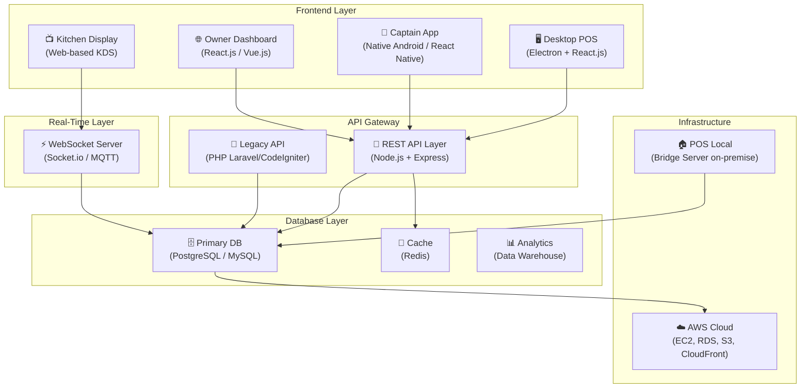
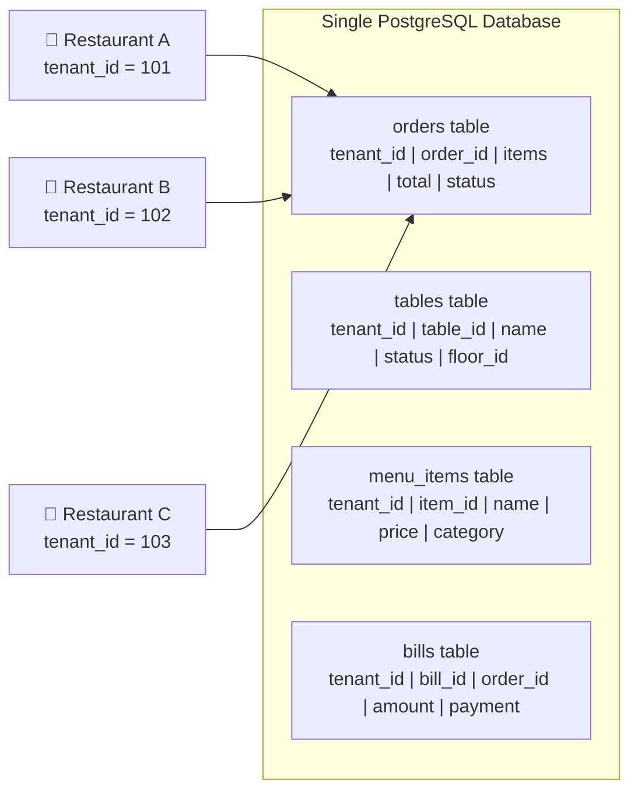
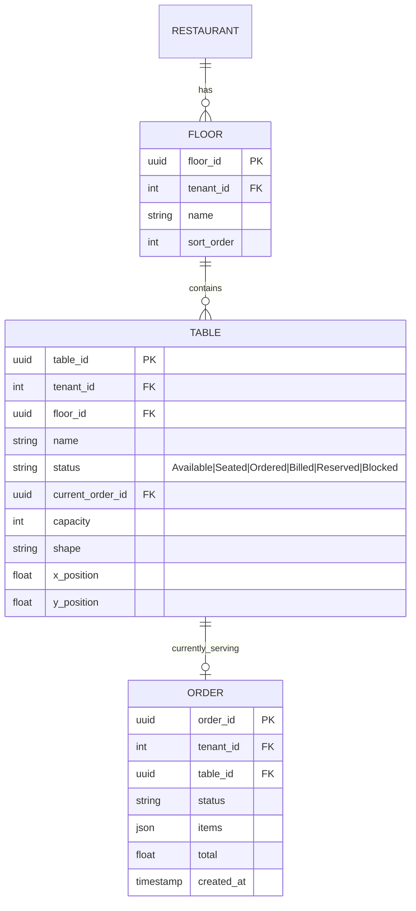
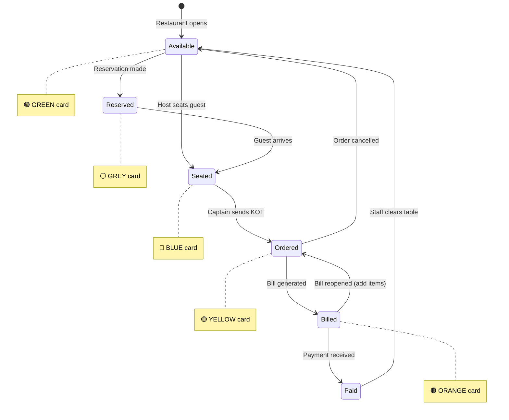
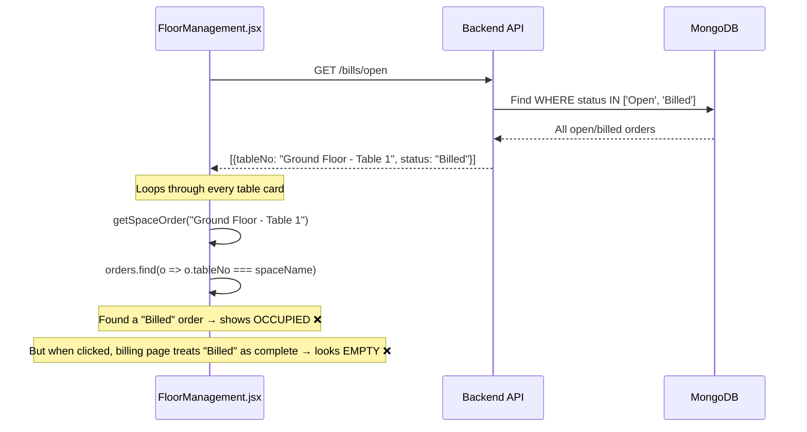
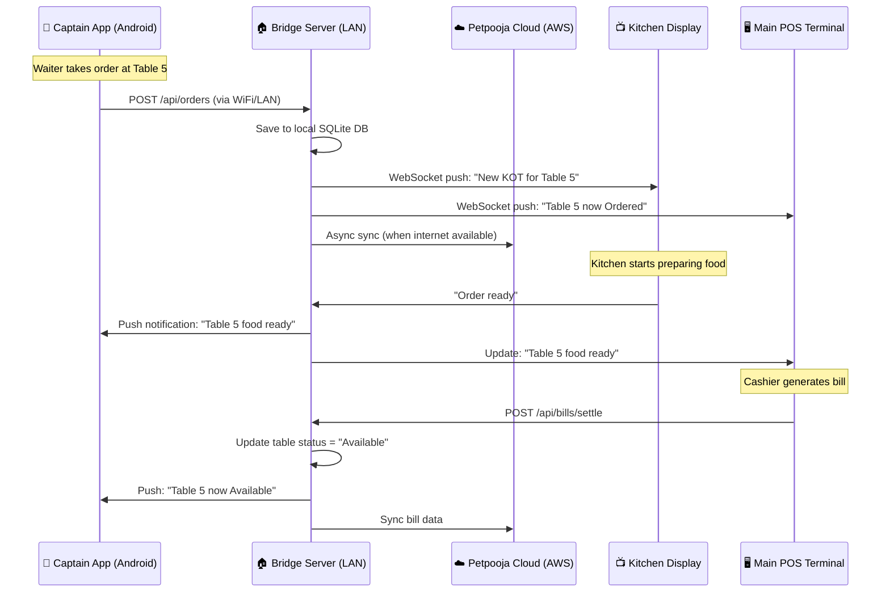
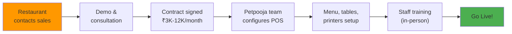

# 🔍 Petpooja POS — Complete Architecture Deep Dive

## Company Scale

| Metric | Value |
|--------|-------|
| **Restaurants served** | 55,000+ outlets across India |
| **Bills processed** | Millions per month |
| **API calls** | 5 million+ per day |
| **Engineering team** | 60+ developers |
| **Integrations** | 200+ third-party services (Zomato, Swiggy, Paytm, etc.) |
| **Database size** | Tens of terabytes |

---

## 1. Technology Stack



### Breakdown

| Layer | Technology | Purpose |
|-------|-----------|---------|
| **Backend API** | Node.js + Express, PHP (Laravel, CodeIgniter) | REST APIs for billing, orders, inventory, menu |
| **Frontend Web** | React.js / Vue.js / Angular | Owner dashboard, web-based POS, admin panels |
| **Desktop POS** | Electron (Chromium + Node.js wrapper) | Offline-capable desktop billing application |
| **Captain App** | Native Android (Java/Kotlin) | Waiter's handheld for table-side ordering |
| **Database** | PostgreSQL / MySQL | Primary transactional data storage |
| **Cache** | Redis | Session management, frequent queries, menu caching |
| **Real-Time** | WebSockets (Socket.io) | Instant KOT routing, table status updates, order sync |
| **Cloud** | AWS (EC2, RDS, S3, CloudFront) | Auto-scaling, CDN, managed databases |
| **Local Server** | Bridge Server (on-premise) | Offline operations, local database, LAN-based sync |

---

## 2. Multi-Tenant Architecture (How Each Restaurant's Data is Isolated)

Petpooja uses a **Shared Database with Tenant-ID Partitioning** model (not database-per-tenant like us):



### How it works:

| Aspect | Petpooja's Approach | Our msbillings Approach |
|--------|---------------------|------------------------|
| **Database model** | Single shared database, `tenant_id` column on every table | Separate MongoDB database per restaurant (`client_maheer_db`, `client_mm_db`) |
| **Data isolation** | Application-level `WHERE tenant_id = ?` on every query | Middleware switches entire database connection per request |
| **Scaling** | One database handles 55,000+ restaurants | Each restaurant = separate database (harder to manage at scale) |
| **New restaurant** | Just insert a row with new `tenant_id` | Must create entire new database + collections |
| **Cross-restaurant queries** | Easy (just remove tenant filter in admin panel) | Hard (must connect to each database separately) |

> [!IMPORTANT]
> **Petpooja uses Tenant-ID isolation (simpler, more scalable).** Our approach (database-per-tenant) gives stronger isolation but is harder to manage. Both are valid — Petpooja chose simplicity because they serve 55,000+ restaurants. At our scale (<10 restaurants), database-per-tenant is actually fine.

---

## 3. Floor & Table Management Architecture

This is the **key difference** between Petpooja and our code. Petpooja stores **table status in the database**. We **derive** table status by querying all orders.

### Petpooja's Table Model (Database-backed)



### How Table Status Changes (Petpooja's State Machine)



**Each status change is an explicit database UPDATE**, not derived from querying orders.

### Our Code's Approach (The Problem)



### Side-by-Side Comparison

| Feature | Petpooja | Our Code (msbillings) |
|---------|----------|----------------------|
| **Table storage** | `tables` collection in DB with `status` field | `localStorage` (lost on cache clear!) |
| **Table ID** | UUID (`table_id: "abc-123"`) | String name (`"Ground Floor - Table 1"`) |
| **Status detection** | Explicit `table.status` field (single source of truth) | Derived: query all orders, match by name string |
| **Status values** | `Available`, `Seated`, `Ordered`, `Billed`, `Reserved`, `Blocked` | Only 2: occupied or free |
| **Status update** | Explicit `UPDATE tables SET status='Ordered' WHERE table_id=?` | No update — just re-queries orders every 10 seconds |
| **Real-time** | WebSocket push: server emits `tableStatusChanged` instantly | Polling every 10 seconds + Socket event that triggers re-fetch |
| **Multi-device** | All devices see same DB status | Each device reads its own localStorage |
| **Table position** | Stored in DB (`x_position`, `y_position`) | Not stored (auto-layout grid) |

> [!WARNING]
> **Critical flaw in our code:** Tables/floors are stored in `localStorage`, not in the database. If you clear browser data or use a different device, all floor configurations are LOST. Petpooja stores everything in the database.

---

## 4. How Petpooja's Captain App Works



### Captain App Architecture

| Component | Technology | Purpose |
|-----------|-----------|---------|
| **App Shell** | Native Android (Java/Kotlin) | Native performance, push notifications, hardware access |
| **Local DB** | SQLite | Offline order queue, menu cache |
| **Sync Engine** | Background Service | Queues orders when offline, syncs when online |
| **Communication** | WebSocket + REST API | Real-time KOT routing over local network |
| **Auth** | JWT Token + Device ID | Secure, offline-capable authentication |

### Key Design: Offline-First

```
┌─────────────────────────────────────┐
│         Captain App (Android)        │
│                                      │
│  ┌──────────────┐  ┌──────────────┐  │
│  │  Order Queue  │  │   Menu DB    │  │
│  │  (SQLite)     │  │  (SQLite)    │  │
│  └──────┬───────┘  └──────────────┘  │
│         │                             │
│  ┌──────▼───────┐                     │
│  │  Sync Engine  │                    │
│  │  (bg thread)  │                    │
│  └──────┬───────┘                     │
└─────────┼───────────────────────────┘
          │
          │ WiFi / LAN
          ▼
┌─────────────────┐    ┌──────────────┐
│  Bridge Server   │───▶│  Cloud API   │
│  (Local Network) │    │  (AWS)       │
└─────────────────┘    └──────────────┘
```

**When internet is DOWN:**
1. Captain takes order → saved to SQLite queue
2. Queue holds order with timestamp
3. When internet returns → Sync Engine pushes all queued orders in sequence
4. Server applies conflict resolution (timestamp-based)

---

## 5. License & Activation Model

### Petpooja's Approach (Subscription + Professional Onboarding)



| Feature | Petpooja | Our msbillings |
|---------|----------|----------------|
| **Activation** | Professional onboarding by Petpooja team | Self-serve: enter license key |
| **License validation** | Account-based (email + password), not key-based | License key matched to hardware ID |
| **Hardware binding** | Account tied to device during setup, can be transferred by support | Random localStorage ID (fragile) |
| **Offline license** | License token stored locally, validated offline with RSA signature | Every login calls Vercel API (fails on cold-start) |
| **Subscription** | Monthly SaaS (₹3K-12K/month, auto-renewal) | One-time license key with expiry date |
| **Multi-device** | Account-based login, works on any registered device | Hardware-bound, one device per license |
| **Renewal** | Automatic via payment gateway | Manual: SuperAdmin updates expiry in dashboard |

> [!IMPORTANT]
> **Petpooja does NOT use license keys like us.** They use **account-based authentication** (email + password) with subscription billing. The restaurant logs in with their credentials, and the server validates the subscription status. No hardware binding needed because the account IS the identity.

---

## 6. Data Sync Architecture (Cloud ↔ Local)

### Two Deployment Models

````carousel
### Model 1: Standard Cloud POS

```
┌──────────────────────┐
│  POS App (Electron)  │
│                      │
│  ┌────────────────┐  │
│  │  Local Cache   │  │
│  │  (IndexedDB)   │  │
│  └───────┬────────┘  │
└──────────┼───────────┘
           │ Internet
           ▼
┌──────────────────────┐
│  Petpooja Cloud      │
│  (AWS RDS)           │
│  PostgreSQL Master   │
└──────────────────────┘
```

- Primary data lives in cloud
- Local cache for offline bills
- Auto-sync when internet returns
- Best for: single outlet, good internet
<!-- slide -->
### Model 2: POS Local (Bridge Server)

```
┌──────────────────────┐
│  POS App (Electron)  │
│                      │
└──────────┬───────────┘
           │ LAN (WiFi)
           ▼
┌──────────────────────┐
│  Bridge Server       │
│  (On-premise PC)     │
│  ┌────────────────┐  │
│  │  Local DB      │  │
│  │  (PostgreSQL/  │  │
│  │   SQLite)      │  │
│  └───────┬────────┘  │
└──────────┼───────────┘
           │ Internet (when available)
           ▼
┌──────────────────────┐
│  Petpooja Cloud      │
│  (AWS)               │
│  Sync & Analytics    │
└──────────────────────┘
```

- Primary data lives LOCALLY
- No internet needed for daily ops
- Cloud sync for reports, menu updates
- Best for: chains, unreliable internet
````

### Sync Conflict Resolution

| Scenario | Resolution Strategy |
|----------|-------------------|
| Same order modified on 2 devices | Last-write-wins with timestamp |
| Order created offline on captain app | Queued with local timestamp, applied in sequence on sync |
| Menu updated from cloud while offline | Cloud version overwrites local on next sync |
| Bill generated offline | Synced to cloud with original timestamp preserved |

---

## 7. What We Need to Learn from Petpooja

### Priority 1: Fix Table Management (Our Biggest Gap)

Our tables are stored in `localStorage`. They should be in MongoDB:

```javascript
// What Petpooja does (and what we should do):
// Table Schema in MongoDB
{
  _id: ObjectId,
  tenantId: "client_mm_db",
  floorId: ObjectId,
  name: "Table 1",
  status: "Available",  // Available | Seated | Ordered | Billed | Reserved
  currentOrderId: null,  // Links to active order
  capacity: 4,
  position: { x: 0, y: 0 }
}
```

### Priority 2: Fix License System

Move from hardware-bound license keys to **account-based authentication**:
- Restaurant logs in with email + password
- Server checks subscription status
- Returns JWT with expiry embedded
- App validates JWT offline

### Priority 3: Add Offline Support

Currently our app is 100% online-dependent. We need:
- Local SQLite/IndexedDB cache for orders
- Background sync queue
- Conflict resolution on reconnect

### Priority 4: Real-Time Table Status

Replace polling with proper WebSocket events:
```javascript
// Instead of polling every 10 seconds:
socket.on('tableStatusChanged', ({ tableId, newStatus }) => {
  updateTableCard(tableId, newStatus); // Instant UI update
});
```

---

## Summary: Architecture Comparison

```mermaid
graph TB
    subgraph "Petpooja Architecture (Professional)"
        P1["Account Login<br/>(email + password)"] --> P2["JWT Token<br/>(offline-capable)"]
        P2 --> P3["Bridge Server<br/>(local DB)"]
        P3 --> P4["WebSocket<br/>(instant updates)"]
        P4 --> P5["Table Status in DB<br/>(single source of truth)"]
        P5 --> P6["Cloud Sync<br/>(AWS, auto-backup)"]
    end
    
    subgraph "Our msbillings (Current)"
        M1["License Key<br/>(hardware-bound)"] --> M2["Vercel API<br/>(cold-start issues)"]
        M2 --> M3["MongoDB Atlas<br/>(cloud-only, no local)"]
        M3 --> M4["Polling 10s<br/>(not real-time)"]
        M4 --> M5["Table in localStorage<br/>(lost on clear)"]
        M5 --> M6["Status derived<br/>(from order queries)"]
    end
    
    style P1 fill:#4caf50,color:#fff
    style P2 fill:#4caf50,color:#fff
    style P3 fill:#4caf50,color:#fff
    style P4 fill:#4caf50,color:#fff
    style P5 fill:#4caf50,color:#fff
    style P6 fill:#4caf50,color:#fff
    
    style M1 fill:#f44336,color:#fff
    style M2 fill:#f44336,color:#fff
    style M3 fill:#ff9800,color:#fff
    style M4 fill:#ff9800,color:#fff
    style M5 fill:#f44336,color:#fff
    style M6 fill:#f44336,color:#fff
```



| Area | Petpooja (Score) | msbillings (Score) |
|------|-----------------|-------------------|
| **License/Auth** | ⭐⭐⭐⭐⭐ Account-based, offline JWT | ⭐⭐ Hardware-bound keys, API-dependent |
| **Floor Management** | ⭐⭐⭐⭐⭐ DB-backed, state machine | ⭐⭐ localStorage, derived status |
| **Offline Support** | ⭐⭐⭐⭐⭐ Bridge Server + SQLite | ⭐ No offline at all |
| **Real-Time** | ⭐⭐⭐⭐⭐ WebSocket push | ⭐⭐⭐ Socket.io + polling hybrid |
| **Multi-Device** | ⭐⭐⭐⭐⭐ Captain App + KDS | ⭐⭐ Single device per restaurant |
| **Scaling** | ⭐⭐⭐⭐⭐ 55,000+ restaurants | ⭐⭐⭐ Works for <50 restaurants |
| **Billing/POS** | ⭐⭐⭐⭐ Mature, all payment types | ⭐⭐⭐⭐ Good core billing |
| **Integrations** | ⭐⭐⭐⭐⭐ 200+ (Zomato, Swiggy, etc.) | ⭐ None yet |
